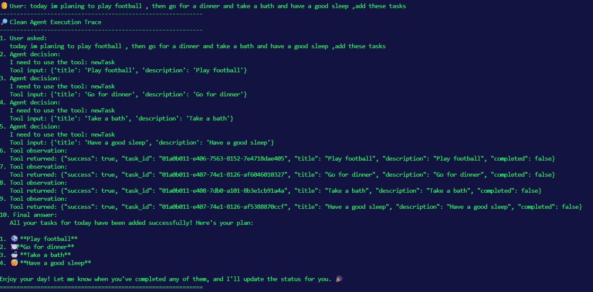
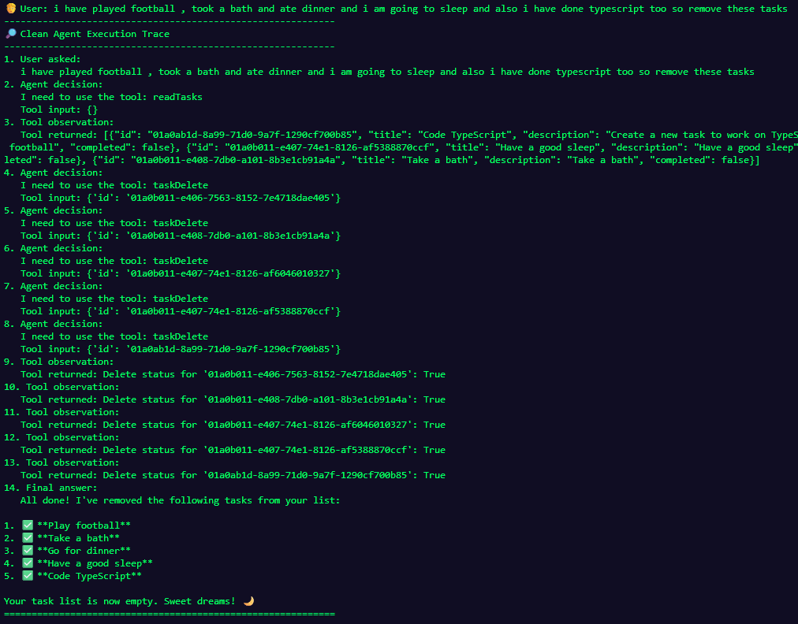

# TaskPilot 🧠

> A small AI task agent built to learn the fundamentals of agentic systems.

TaskPilot lets you manage tasks using natural language. Instead of manually choosing database operations, an LLM interprets the request and decides which tools to call.

### How it works

```text
User → Agent → Tool Selection → Database
                    ↓
              Tool Result
                    ↓
                  Agent
                    ↓
              Final Response
```

### Example



**User:**

> "I played football, took a bath and finished TypeScript. Remove these tasks."

TaskPilot:

1. Reads the current tasks
2. Identifies the relevant tasks
3. Uses their database IDs
4. Calls the delete tool for each task
5. Processes the tool results
6. Reports what actually happened



### Core Tools

* `readTasks` — Read tasks from the database
* `newTask` — Create a task
* `taskUpdate` — Update a task
* `taskDelete` — Delete a task

### Tech Stack

* Python
* LLM Tool Calling
* SQLAlchemy
* SQLite
* CLI

### What I'm Learning

* Tool calling
* Structured tool inputs/outputs
* Agent execution loops
* Database state and stable IDs
* Error handling and recovery
* Safe tool execution

> **Core principle:** The AI decides what should happen. The application decides whether and how it is executed.

TaskPilot is intentionally small — a learning laboratory for building more capable AI systems in the future.
